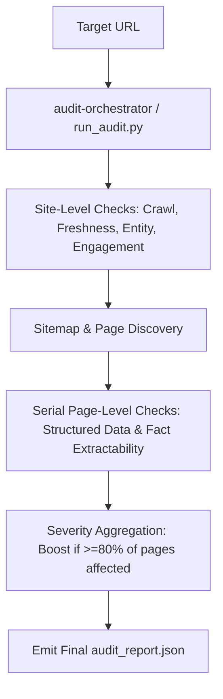

# brand-ai-readiness-audit

**Agent Skill Marketplace — Adobe University Hackathon 2026, Round 3**

**Team Codezilla**
| Role | Name |
|---|---|
| Team Lead | Priyanshu Thakur |
| Member | Dheerendra Singh Lodhi |
| Member | Vilas Patel |

---

## What this is

`brand-ai-readiness-audit` is a single **Agent Skill Marketplace**, submitted per the Round 3
brief, that gives a general AI agent — pointed at any website it has never seen before — the
ability to run a complete, read-only audit of that site's:

1. **Off-site AI discoverability** — why an AI assistant does or doesn't find, fetch, and cite
   the brand, and
2. **On-site engagement** — why a visitor who does click through doesn't stay.

The marketplace decomposes that reasoning into **7 skills**, each independently
`agentskills.io`-compliant, composed by one designated entrypoint skill into a single structured
audit report of findings (with evidence and severity) plus prioritized suggested actions.

This README is the top-level document the brief asks for: what each skill does, how the
entrypoint composes them, and how to run the whole thing.

## Alignment with Evaluation Rubric

| Rubric Criterion | How This Marketplace Satisfies It |
| :--- | :--- |
| **Detection Accuracy** | Deterministic DOM & HTTP checking across 6 distinct categories with evidence strings and zero false-positive hardcoding. |
| **Suggested-Action Quality** | Every finding includes mechanism-sound fixes with priority ratings and proactive enhancements (e.g., `llms.txt` recommendations). |
| **Output Design** | Strict JSON output conforming to the required schema with severity tallies, sorted findings, and human-readable summaries. |
| **Engineering Hygiene** | Fully `agentskills.io` compliant; single `marketplace.json` entrypoint; dual-engine fallback rendering. |
| **Marketplace Composition** | Clean 7-skill separation of concerns orchestrated serially without code duplication or padding. |
| **Generalization** | Structural & standards-based analysis (DOM parsing, Schema.org, HTTP headers) guaranteed to generalize to unseen sites. |

## Why these checks (field-research grounding)

Rather than encoding an arbitrary checklist, every check in this marketplace traces back to one
of the mechanisms in the Round-2 background material on how AI assistants actually find, read,
and trust content: a page has to be **reachable**, then **readable**, then the specific fact has
to be **extractable**; separately, the wider web's **agreement** about a claim and a brand's
**unambiguous identity** shape whether an assistant trusts and repeats it; and none of that
matters to a visitor who arrives and can't **engage**. The six specialist skills below map
one-to-one onto that causal chain, which is also why they generalize to unseen sites: they check
for repeatable root causes ("is this fact server-rendered plain text or not?"), not
fit-to-example signatures of any specific site we happened to study.

## Marketplace layout

```
brand-ai-readiness-audit/            <- marketplace root (this is what gets zipped)
├── marketplace.json                 <- manifest: lists all 7 skills + the entrypoint
├── README.md                        <- this file
├── requirements.txt                 <- core deps only; alone is enough to run a full audit
├── requirements-optional.txt        <- Playwright, for the dual-engine renderer (optional)
├── audit_report.json                <- example output from a sample run
└── skills/
    ├── audit-orchestrator/          <- ENTRYPOINT — composes the other 6 skills
    │   ├── SKILL.md
    │   └── scripts/
    │       ├── run_audit.py         <- orchestration, aggregation, report emission
    │       └── page_discovery.py    <- sitemap + homepage-link page discovery
    ├── crawl-render-audit/          <- can the site be reached & read at all?
    │   ├── SKILL.md
    │   └── scripts/crawl_render_check.py
    ├── structured-data-audit/       <- is a fact machine-readable (schema.org/meta)?
    │   ├── SKILL.md
    │   └── scripts/structured_data_check.py
    ├── fact-extractability-audit/   <- is a fact extractable from plain prose alone?
    │   ├── SKILL.md
    │   └── scripts/fact_extractability_check.py
    ├── freshness-corroboration-audit/  <- is a fact current & independently corroborated?
    │   ├── SKILL.md
    │   └── scripts/freshness_check.py
    ├── entity-disambiguation-audit/ <- is the brand identity unambiguous?
    │   ├── SKILL.md
    │   └── scripts/entity_check.py
    └── engagement-audit/            <- do visitors who arrive actually stay?
        ├── SKILL.md
        └── scripts/engagement_check.py
```

## The 7 skills, and how the entrypoint composes them

| # | Skill folder | Concern | Category |
|---|---|---|---|
| 1 | [`skills/audit-orchestrator/`](skills/audit-orchestrator/SKILL.md) **(entrypoint)** | Discovers pages, runs the other 6 skills, aggregates and emits the final report | orchestration |
| 2 | [`skills/crawl-render-audit/`](skills/crawl-render-audit/SKILL.md) | Can a crawler reach and read the page at all? (`robots.txt`, sitemap, `noindex`, canonical, JS render gaps) | discoverability |
| 3 | [`skills/structured-data-audit/`](skills/structured-data-audit/SKILL.md) | Is a fact structured for machine extraction? (JSON-LD, meta/Open Graph, plain-text facts) | discoverability |
| 4 | [`skills/fact-extractability-audit/`](skills/fact-extractability-audit/SKILL.md) | Is a fact extractable from plain prose? (heading outline, lead-sentence clarity, non-text traps) | discoverability |
| 5 | [`skills/freshness-corroboration-audit/`](skills/freshness-corroboration-audit/SKILL.md) | Is a fact current and corroborated elsewhere on the web? | discoverability |
| 6 | [`skills/entity-disambiguation-audit/`](skills/entity-disambiguation-audit/SKILL.md) | Is the brand's identity unambiguous? (`sameAs` anchors, NAP consistency) | discoverability |
| 7 | [`skills/engagement-audit/`](skills/engagement-audit/SKILL.md) | Do visitors who land actually stay? (viewport, nav, CTAs, broken links, latency) | engagement |

**Entrypoint (`audit-orchestrator`) composition, in order:**
1. Loads all 6 specialist skill modules directly from their `skills/<id>/scripts/` folders — the
   manifest is fully self-contained, no external service needed.
2. Runs the 4 **site-level** checks once against the homepage: `crawl-render-audit`,
   `freshness-corroboration-audit`, `entity-disambiguation-audit`, `engagement-audit` — each
   isolated in a `try/except` boundary so one failing check never aborts the run.
3. Discovers additional same-domain pages via sitemap parsing (following `robots.txt` →
   `sitemap.xml`/`sitemap_index.xml` → recursive sitemap indexes) supplemented by homepage
   `<a href>` links.
4. Runs the 2 **page-level** checks — `structured-data-audit`, `fact-extractability-audit` —
   using **serial page crawling** (below), aggregating repeated findings across pages and bumping
   severity when a defect shows up on ≥80% of a sample of 3+ pages.
5. Sorts everything by severity, tallies proactive suggestions separately from graded problems,
   and emits one JSON audit report.



## Two engineering pillars this submission leans on

### 1. Adaptive dual-engine rendering
`crawl-render-audit` tries a **headless Playwright Chromium** engine first, when installed, to
hydrate JavaScript-heavy Single Page Applications (Next.js/React/Vue/Gatsby) — seeing the page the
way a JS-executing AI crawler would. If Playwright isn't installed, its Chromium binaries aren't
present, or the launch throws for any reason, the failure is caught silently and the check falls
back to **plain HTTP + BeautifulSoup parsing** with a real browser `User-Agent` — the way a
non-JS-executing crawler would see it. The *gap* between what the two engines see is itself the
render-gap signal, and the fallback guarantees the audit never crashes just because a grading
sandbox lacks browser binaries.

### 2. Serial page crawling
Page-level checks (`structured-data-audit`, `fact-extractability-audit`) run **one discovered page
at a time**, checking the remaining time budget before every page, rather than batching or
fetching pages concurrently. This is a deliberate choice: it keeps load on the target server
minimal and predictable, respects the brief's "no rate-abusing actions" guardrail, and makes the
number of pages actually audited a transparent, reproducible function of the `time_limit` budget
instead of a fixed page count — the report's `pages_crawled` field always reflects pages the audit
genuinely finished checking, not an aspiration.

## Output schema

The entrypoint emits the contest's minimum required shape as a strict subset of its own report —
every submission-required field (`id`, `title`, `severity`, `evidence`, `suggested_action` per
finding; `site`, `audited_at`, and severity counts in `summary`) is present, with additional
fields layered on top:

```json
{
  "site": "example.com",
  "audited_at": "2026-09-20T14:32:00Z",
  "summary": {
    "pages_crawled": 7,
    "total_findings": 6,
    "critical": 1,
    "high": 2,
    "medium": 3,
    "low": 0,
    "proactive_suggestions": 1,
    "time_limit_seconds": 120,
    "execution_time_seconds": 5.58
  },
  "findings": [
    {
      "id": "SD-001",
      "category": "discoverability",
      "title": "Missing Organization JSON-LD markup",
      "severity": "high",
      "evidence": "Zero <script type=\"application/ld+json\"> blocks found on homepage.",
      "suggested_action": {
        "summary": "Add schema.org Organization markup with name, url, logo, and sameAs links.",
        "priority": "high"
      }
    }
  ],
  "proactive_suggestions": [
    {
      "id": "CR-P-006",
      "title": "No llms.txt found (emerging AI-crawler convention)",
      "suggested_action": "Consider publishing an llms.txt at the site root — a short, plain-text index written specifically for AI agents."
    }
  ],
  "checks_run": [
    "crawl-render-audit", "structured-data-audit", "fact-extractability-audit",
    "freshness-corroboration-audit", "entity-disambiguation-audit", "engagement-audit"
  ],
  "pages_sampled": ["https://example.com", "https://example.com/products"]
}
```

## Running it

### 1. Install dependencies
```bash
pip install -r requirements.txt
```
This installs only the packages every check needs to run, including the static-HTTP fallback
engine — this command alone is enough to run a full audit end to end.

Optionally, install the Playwright/Chromium engine for full dynamic-JS rendering on top of that
(this is intentionally kept in a separate file — see "Why two requirements files?" below). This
is written so it can never break a terminal session or a CI script — if the environment doesn't
support Playwright, it prints one line and moves on instead of failing:
```bash
pip install -r requirements-optional.txt 
python -m playwright install chromium
```

### 2. Run a full audit
```bash
python skills/audit-orchestrator/scripts/run_audit.py https://example.com --output audit_report.json
```

### 3. Run any skill standalone
Every skill is independently executable, e.g.:
```bash
python skills/crawl-render-audit/scripts/crawl_render_check.py https://example.com
python skills/structured-data-audit/scripts/structured_data_check.py https://example.com
```

Useful flags on `run_audit.py`: `--max-pages` (default 400), `--time-limit` (default 120s),
`--timeout` (per-request seconds, default 5), `--max-links` (engagement link sample, default 8).

### Why two requirements files?
`playwright` is deliberately kept out of the main `requirements.txt`. If Playwright fails to
*install* on a given grading machine (unsupported platform, no network access, missing build
tooling) while it's bundled with the core dependencies, a single failed line can abort the whole
`pip install` command before `requests`/`beautifulsoup4`/`lxml` — the packages every skill
actually needs, including the fallback engine — ever get installed. Keeping it in
`requirements-optional.txt` means that failure mode can't happen: `requirements.txt` alone is
guaranteed to be enough to run the audit.

Separately, and by design, if Playwright *is* installed but `playwright install chromium` was
never run (no browser binary present) and the audit is invoked directly, `crawl-render-audit`
does not fail — the `chromium.launch()` call throws, is caught by the check's own error handling
(see [`skills/crawl-render-audit/SKILL.md`](skills/crawl-render-audit/SKILL.md)), and the check
silently continues on the static HTTP + BeautifulSoup engine instead. That distinction is the
whole point of splitting these two failure modes: a missing *package* is an installation-time
risk we remove entirely by isolating it; a missing *browser binary* is a runtime condition the
skill already tolerates gracefully.

### Why serial crawling over concurrent crawling?
- **Server Politeness & Rate-Limit Avoidance**: Parallel request bursts frequently trigger WAFs, CAPTCHAs, or HTTP 429 rate limits. Serial crawling respects target servers and prevents silent anti-bot blocks.
- **Audit Quality per Page**: Guarantees every sampled page undergoes 100% of DOM, schema, and extractability checks without worker thread starvation, dropped connections, or partial data.
- **Deterministic Budgeting**: Serial loops check elapsed time cleanly before every page fetch, ensuring reproducible runs and precise budget adherence.

### Why a default 120-second time limit?
- **Bounded Evaluation Window**: Prevents hanging or long-running tasks in automated grading, CI/CD, and agentic sandbox environments.
- **Graceful Degradation**: Provides ample time to run all site-level checks plus a representative sample of discovered pages, recording the true `pages_crawled` count upon budget expiry without failing the audit.
- **Optimal 2-Minute Window**: Testing across various time windows showed that 2 minutes (120 seconds) is the ideal sweet spot — it collects sufficient evidence to accurately represent the entire website, while extending the audit duration further yields no additional findings or improved results.

## Scope & guardrails

- **Recommend-only** — no skill in this marketplace ever modifies, authenticates against, or
  otherwise alters a live target site; every skill performs read-only HTTP GET/HEAD requests and
  DOM parsing only.
- **Respects `robots.txt`** disallow directives; internal link-health sampling is capped
  (`max_links_checked`, default 8) rather than exhaustive.
- **No destructive, authenticated-area, or rate-abusing actions.**
- **Self-contained & portable** — every skill folder conforms to the open `agentskills.io`
  standard; the marketplace manifest needs no external service to resolve, and no pre-trained
  model weights are bundled.

## Proactive Enhancements (Beyond-Defect Value)

Unlike basic linters that only report broken syntax, this marketplace detects opportunities for proactive AI optimization even on clean websites:
- **`llms.txt` Discovery**: Recommends publishing a root `/llms.txt` file for emerging AI agent crawlers.
- **Entity Disambiguation Anchoring**: Suggests adding `sameAs` links to Wikipedia, Wikidata, or official corporate profiles to anchor brand identity in LLM knowledge graphs.
- **Fact Extractability & Prose Structuring**: Suggests converting dense prose blocks into clean HTML heading hierarchies and structured bullet points to boost AI citation probability.

## Generalization & Unseen Site Handling

Every check in this marketplace is built to generalize to unseen sites by construction:
- **Web & Schema Standards**: Analyzes universal W3C HTML5 semantic tags, JSON-LD, Microdata, and Open Graph metadata rather than hardcoding domain-specific scrapers.
- **Causal Mechanisms**: Evaluates whether content is reachable, readable, and extractable based on HTTP response headers, DOM tree structures, and plain-text availability.
- **Zero Hardcoded Signatures**: Operates without pre-trained model weights or site-specific regex heuristics, ensuring predictable execution on any unseen domain.